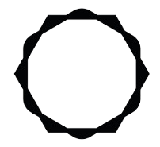

# Floras Style Guide
**Version 1.0 — Source of truth for all brand expression**

This document defines the rules for how Floras looks, sounds, and feels across every artifact the design system produces. Every skill file, template, and generated output must conform to these rules. When in doubt, return here.

---

## 1. Brand Foundation

### Who Floras Is
Floras turns every B2B transaction into measurable CO₂ reduction. Enterprises and their suppliers use Floras to cut supply chain emissions — transparently, strategically, and together. The Floras currency is issued when goods arrive, collected in a wallet, and allocated toward verified climate projects. Enterprises receive carbon credit or SAF certificates as proof.

### What Floras Is Not
Floras is not a carbon offset marketplace. It is not a CSR reporting tool. It is not a generic sustainability platform. It is a supply chain decarbonization engine with a currency at its center. This distinction must come through in every word and visual.

### The One-Sentence Summary
> Floras makes every transaction a climate action — with no extra budget, full traceability, and compliance-ready reporting.

### Tagline
> Reward The Earth

Use exactly this casing. Never "Reward the earth" or "REWARD THE EARTH."

---

## 2. Color System

All colors are defined as CSS custom properties. Every artifact must use these variables — never hardcode hex values directly in output files.

### Primary Palette

| Token | Hex | Usage |
|-------|-----|-------|
| `--color-forest` | `#3d5e3a` | Primary brand color. Dark forest green. Used for hero backgrounds, wallet cards, key UI surfaces. |
| `--color-leaf` | `#4a7c59` | Action green. Buttons, CTAs, active states, primary interactive elements. |
| `--color-olive` | `#5a6e3a` | Gradient start. Used in wallet card gradient alongside `--color-forest`. |
| `--color-brand-text` | `#9c9d65` | Yellow-olive used for headings, section labels, and emphasis text on light backgrounds. Confirmed from app UI. |

### Neutral Palette

| Token | Hex | Usage |
|-------|-----|-------|
| `--color-bg` | `#f5f5f3` | Primary background. Warm light gray — never pure white. |
| `--color-surface` | `#ffffff` | Card and panel backgrounds. |
| `--color-surface-warm` | `#f9f8f6` | Slightly warm surface for nested sections. |
| `--color-surface-sage` | `#f3f5eb` | Light sage green surface. Used for balance cards, subtle green-tinted panel backgrounds. |
| `--color-text` | `#1a2416` | Primary body text. Very dark green-charcoal — not pure black. |
| `--color-text-muted` | `#6b7c65` | Secondary text, metadata, labels. Muted green-gray. |
| `--color-border` | `#e2e8dd` | Card borders, dividers, input outlines. |
| `--color-border-soft` | `#eceee9` | Softer dividers, subtle section separators. |

### Semantic / Utility Colors

| Token | Hex | Usage |
|-------|-----|-------|
| `--color-balance-bg` | `#4e6b38` | "Current Balance" stat card background. Solid olive-green. |
| `--color-wallet-start` | `#9c9d65` | Wallet card gradient start (top-left). Warm yellow-olive confirmed from app UI. |
| `--color-wallet-end` | `#3d5e3a` | Wallet card gradient end (bottom-right). |
| `--color-impact-text` | `#6b7c65` | Used for "CO₂ Impact" section headings and certificate-related text. |
| `--color-focus` | `#2d6a4f` | Focus rings and keyboard navigation indicators. |

### Color Rules

- **Never use pure white (`#ffffff`) as a page background.** Always use `--color-bg`. White (`--color-surface`) is reserved for cards and panels only — it reads as elevated against the warm gray background.
- **Never use pure black for text.** Always use `--color-text`.
- The primary action color is `--color-leaf`. Use it for one primary CTA per section — not for decorative elements.
- Forest green backgrounds (`--color-forest`, `--color-wallet-start/end`) always use white text.
- On light backgrounds (`--color-bg`, `--color-surface`), heading text uses `--color-brand-text` for brand emphasis or `--color-text` for body.
- The wallet card gradient always runs `--color-wallet-start` → `--color-wallet-end` at 135deg.
- Green on green is allowed only when contrast ratio meets WCAG AA (4.5:1 minimum for body text, 3:1 for large text).

---

## 3. Typography

### Typefaces

| Role | Family | Weight | Notes |
|------|--------|--------|-------|
| **Primary / Body** | Rubik | 400, 500, 600, 700 | Used for all body copy, UI labels, navigation, buttons |
| **Logo / Wordmark** | Rubik | 300–400 | Tracked at 0.15em. All caps. The wordmark is always `FLORAS` in spaced thin weight. |
| **Display / Hero** | Rubik | 700–800 | Large hero headlines use heavy Rubik. No separate display typeface. |
| **Data / Metrics** | Rubik | 800 | Balance figures, CO₂ kg numbers, stat values use extra-bold Rubik |

Rubik is loaded from Google Fonts: `family=Rubik:wght@300;400;500;600;700;800`

> **Note for team:** Rubik is specified based on visual analysis of the Floras app UI and confirmed in the DISH Loyalty reference codebase (which shares the same design approach). If Floras has a different font loaded in their own codebase, this should be updated to match. The weight hierarchy and scale below hold regardless of the specific typeface.

### Type Scale

| Token | Size | Weight | Line Height | Usage |
|-------|------|--------|-------------|-------|
| `--text-hero` | 2.8rem | 800 | 1.05 | Hero headlines ("Join Floras and invest in regenerative futures.") |
| `--text-h1` | 2.2rem | 700 | 1.1 | Page titles, section heroes |
| `--text-h2` | 1.6rem | 700 | 1.2 | Section headings |
| `--text-h3` | 1.2rem | 600 | 1.3 | Card titles, sub-section headings |
| `--text-label` | 0.72rem | 700 | 1.2 | ALL CAPS tracked labels (e.g. "REWARD THE EARTH", "YOUR BALANCE", "CURRENT BALANCE") |
| `--text-body` | 1rem | 400 | 1.6 | All body copy |
| `--text-body-sm` | 0.875rem | 400 | 1.5 | Secondary body, metadata |
| `--text-stat` | 2.4rem | 800 | 1.0 | Large metric values (balance, CO₂ kg) |
| `--text-button` | 0.875rem | 700 | 1 | Button labels — always sentence case, never all caps |

### Typography Rules

- **Body copy is never smaller than 0.875rem.**
- **Labels above sections use ALL CAPS with letter-spacing 0.12em** in `--color-brand-text` or `--color-text-muted`. Example: "REWARD THE EARTH", "FLORAS ACCOUNT", "YOUR BALANCE".
- **Headlines are bold but never decorative.** No gradients on headline text, no outlined type, no text shadows.
- **Stat values (balance, CO₂ offset) use Rubik 800 at large scale** — this is a signature visual pattern of the Floras UI.
- **Button labels are sentence case.** "Complete Purchase" not "COMPLETE PURCHASE" not "complete purchase."
- **The logo wordmark `FLORAS` uses letter-spacing 0.15em** and should never be modified, stretched, or recolored outside of approved palette.

---

## 4. Logo & Brand Mark

### Wordmark
The primary logo is the wordmark: `FLORAS` in spaced thin Rubik, all caps. It appears in the top-left of every interface.

- **On light backgrounds:** `--color-text` (dark charcoal-green)
- **On dark/forest backgrounds:** `#ffffff` (white)
- **Minimum clear space:** Equal to the height of the letter "F" on all sides
- **Never:** Recolor to a non-brand color, add a drop shadow, italicize, compress or stretch horizontally

### Icon Mark
The circular icon mark — `○ FLORAS` — appears on the wallet card and dark promotional surfaces. It consists of a thin circle outline followed by the wordmark.

- Used only on dark green backgrounds (`--color-forest` or gradient)
- Always in white
- Never used as a standalone favicon-style mark at small sizes — use the wordmark instead

### Logo on Different Backgrounds
| Background | Logo treatment |
|------------|---------------|
| `--color-bg` (light gray) | Dark wordmark in `--color-text` |
| `--color-surface` (white) | Dark wordmark in `--color-text` |
| `--color-forest` or gradient | White wordmark |
| Photography/imagery | White wordmark with sufficient contrast |

### PNG Logo Assets
Two logo files are available — both are the circular icon mark only. Both must be in the same folder as any HTML output.

- `light-logo.png` — white icon on transparent background. Use on dark surfaces only (forest green, wallet gradient).
- `dark-logo.png` — dark icon on transparent background. Use on light surfaces only (`--color-bg`, `--color-surface`).

### Logo Treatment in HTML Artifacts
Always pair the icon with the FLORAS wordmark in a flex row — never use the icon alone.

**On dark backgrounds (header, footer):**
```html
<div style="display:flex; align-items:center; gap:8px;">
  
  <span style="font-size:0.95rem; font-weight:300; letter-spacing:0.15em; color:#fff;">FLORAS</span>
</div>
```

**On light backgrounds:**
```html
<div style="display:flex; align-items:center; gap:8px;">
  
  <span style="font-size:0.95rem; font-weight:300; letter-spacing:0.15em; color:var(--color-text);">FLORAS</span>
</div>
```

---

## 5. Tone of Voice

### Core Characteristics
Floras speaks with **quiet confidence**. It does not shout. It does not oversell. It states facts and lets the impact speak.

| Quality | What it means in practice |
|---------|--------------------------|
| **Direct** | Short sentences. Active verbs. "Floras turns every transaction into measurable CO₂ reduction." Not "Floras provides a comprehensive solution for..." |
| **Specific** | Always concrete. "Reduce supply chain emissions by embedding Floras into supplier transactions." Not "help your company become more sustainable." |
| **Accountable** | We only say what we can back up. No vague claims. If we can't prove it, we don't say it. |
| **Warm but not casual** | We care about the planet and the people we work with. But we're talking to procurement heads and sustainability directors — not friends on Instagram. |
| **Mission-driven, not preachy** | The climate stakes are real but Floras doesn't lecture. It offers a mechanism, not a sermon. |

### Approved Language

| Use this | Not this |
|----------|----------|
| supply chain emissions | carbon footprint (too vague) |
| verified climate projects | offset programs |
| CO₂ reduction | going green |
| compliance-ready reporting | ESG compliance (too broad) |
| Floras (the currency) | points, tokens, credits |
| verified impact certificate | carbon credit certificate (unless technically accurate) |
| strategic sustainability partner | sustainability vendor |
| Turn every transaction into climate action | Be more sustainable |

### Banned Phrases
Never use in any Floras artifact:
- "carbon neutral" (unless a specific verified certificate says so)
- "net zero" (unless referring to a client's stated goal, attributed)
- "eco-friendly"
- "green"
- "planet-friendly"
- "making the world a better place"
- "leverage" (as a verb)
- "synergies"
- "seamless"
- "best-in-class"

### Writing Patterns

**Headlines:** Declarative, action-oriented. Subject + verb + outcome.
> "Turn Every Transaction Into Climate Action"
> "Reduce Supply Chain Emissions Without Capital Expenditure"

**Body copy:** One idea per sentence. Max 2-3 sentences per paragraph. Always end a section with either a proof point or a next action.

**CTAs:** Specific and action-led. "Contact Us" is acceptable. "Get Started" is generic — avoid. "View Your Impact" or "Allocate Floras" are preferred.

**Numbers:** Always include the unit. "310 kg CO₂e / Flora" not "310 CO₂." Use the subscript notation CO₂ where possible.

**Proof discipline:** Sourced statistics are always preferred over general claims. "Supply chains account for over 80% of enterprise greenhouse gas emissions" is acceptable because it is an industry-cited figure. Vague claims like "most companies struggle with..." are not — if it can't be sourced, rewrite it as a specific mechanism instead. When a claim cannot be verified, mark it `[NEEDS PROOF]` rather than publishing it.

---

## 6. Layout Principles

### Grid
- **Max content width:** 1200px, centered
- **Page padding:** 24px on mobile, 48px on desktop
- **Card gap:** 16px between cards in a grid
- **Section spacing:** 64px between major page sections (48px on mobile)

### Card Anatomy
Cards are the primary content unit in Floras. Every card follows this structure:
- Border-radius: 16px (large cards), 12px (small/metric cards)
- Background: `--color-surface` with `box-shadow: 0 2px 8px rgba(0,0,0,0.06)`
- Internal padding: 24px (large), 16px (small metric cards)
- Border: `1px solid --color-border` (optional — use when card sits on `--color-surface` rather than `--color-bg`)

### Stat Cards (Metric Display Pattern)
A recurring pattern across the Floras UI. Used for: Current Balance, Total Invested, CO₂ Offset, Projects Funded.

- Label: ALL CAPS, `--text-label`, `--color-text-muted`
- Value: `--text-stat` (2.4rem, weight 800), `--color-text`
- Unit (e.g. "Floras", "kg"): `--text-body`, `--color-text-muted`, inline after value
- The "Current Balance" variant uses `--color-balance-bg` as background with white text

### Wallet Card Pattern
A gradient card used to display the Floras credit balance.
- Background: `linear-gradient(135deg, --color-wallet-start, --color-wallet-end)`
- Text: white throughout
- Icon mark: `○ FLORAS` in white
- Balance label: ALL CAPS tracked label
- Balance value: large Rubik 800 in white

### Navigation
- Top navigation bar: white background, `FLORAS` wordmark left-aligned
- Nav items: `--color-text-muted`, hover state `--color-brand-text`
- Active state: `--color-brand-text`, font-weight 600
- Sidebar navigation (wallet/dashboard): icon + label, active item has `--color-leaf` icon

### Button Hierarchy

| Variant | Style | Usage |
|---------|-------|-------|
| **Primary** | `--color-leaf` background, white text, border-radius 8–12px, padding 12px 24px | One per section. Main CTA. |
| **Secondary** | White background, `1px solid --color-border`, `--color-text`, border-radius 8–12px | Supporting actions |
| **Ghost / Text** | No background or border, `--color-brand-text`, underline on hover | Inline links and low-priority actions |
| **Outline** | `1px solid --color-leaf`, `--color-leaf` text, transparent background | Alternative secondary on dark surfaces |

Buttons always use sentence case. Border-radius is moderate — approximately 8–12px. Never pill-shaped (999px) on primary actions. Never sharp (0px radius).

---

## 7. Imagery & Visual Language

### Photography Style
- **Subject matter:** Nature (forests, soil, sky, water), agriculture, industrial infrastructure, aerial supply chain, clean energy. Never stock-photo people shaking hands.
- **Tone:** Documentary, quiet, high contrast. Natural light preferred.
- **Color grade:** Slightly desaturated. Earthy. Consistent with the dark green palette — no warm orange/yellow tones that clash.
- **Avoid:** Generic sustainability clichés (lightbulbs, seedlings in hands, solar panels on generic rooftops with blue sky)

### Project Cards
Each climate project gets a card with:
- A full-bleed photo (nature/project imagery)
- Project name in `--text-h3`
- Location in `--text-body-sm`, `--color-text-muted`
- CO₂ rate badge: `--color-brand-text` text, `--color-surface-warm` background, `--color-border` border

### Icons
- Line icons only. 1.5–2px stroke weight. Rounded caps and joins.
- Color: `--color-text-muted` default, `--color-leaf` active/selected
- Size: 20px standard, 24px in navigation

### Illustration
Currently none in the Floras brand. Do not introduce illustrative elements unless explicitly briefed.

---

## 8. The Floras Currency

The Floras currency has specific visual and copy rules:

- **Name:** "Floras" (capital F, plural is also "Floras" not "Flori" or "Flora tokens")
- **Icon:** The circular mark `○` precedes "FLORAS" in the wallet card context
- **Rate display:** Always shown as `X kg CO₂e / Flora` — the unit is CO₂e per Flora, not the other way round
- **Pricing:** 1 Flora = $0.02 USD (do not publish this in client-facing materials without approval)
- **In copy:** "Floras flow to your wallet" not "points are added to your account"
- **Balance display:** Always in whole numbers. Never decimals.

---

## 9. Partner & Certificate Logos

When displaying partner logos (Berkeley SkyDeck, Puro Earth, Aclymate, Anew, etc.):
- Display in grayscale or dark single-color version on light backgrounds
- Minimum height: 24px, maximum height: 48px in a partner row
- Equal spacing between logos in a horizontal row
- Never place on a colored background that reduces legibility

---

## 10. What This Style Guide Does Not Cover

These are handled in the individual skill files:

- How to structure a sales presentation (→ `skills/presentation.md`)
- How to write a sales email (→ `skills/email.md`)
- How to produce a one-pager (→ `skills/one-pager.md`)
- How to write social copy (→ `skills/social-post.md`)

When generating any artifact, always load this style guide first, then the relevant skill file.
